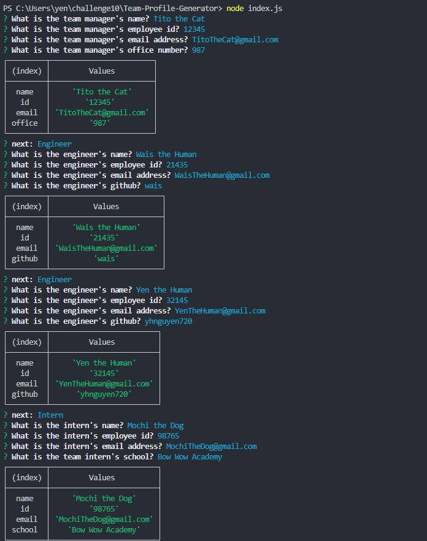
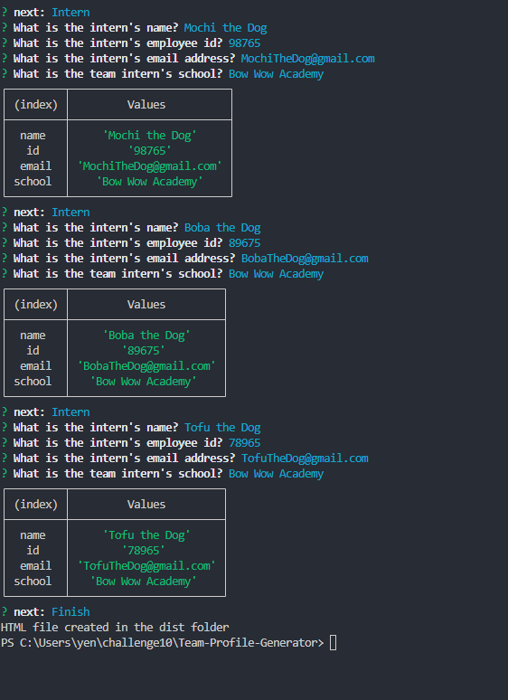
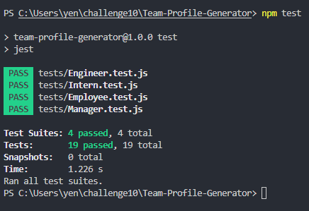
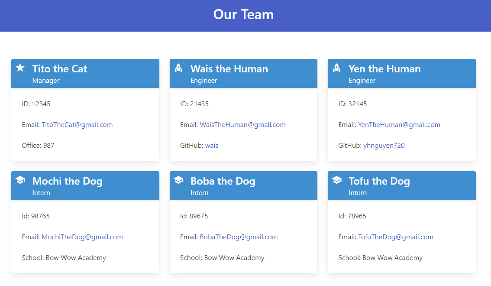

# Team Profile Generator

## Table of Contents
- [Description](#description)
- [User Story](#user-story)
- [Acceptance Criteria](#acceptance-criteria)
- [Installation](#installation)
- [Usage](#usage)
- [Demonstration](#demonstration)
- [Contributing](#contributing)
- [Questions](#questions)

## Description

```md
This command-line application takes in information about employees in a software engineering team then generates an HTML webpage that displays summaries for each person. The application uses Jest for running unit tests to ensure each part of the code passes. 
```

## User Story

```md
AS A manager
I WANT to generate a webpage that displays my team's basic info
SO THAT I have quick access to their emails and GitHub profiles
```

## Acceptance Criteria

```md
GIVEN a command-line application that accepts user input
GIVEN a command-line application that accepts user input
WHEN I am prompted for my team members and their information
THEN an HTML file is generated that displays a nicely formatted team roster based on user input
WHEN I click on an email address in the HTML
THEN my default email program opens and populates the TO field of the email with the address
WHEN I click on the GitHub username
THEN that GitHub profile opens in a new tab
WHEN I start the application
THEN I am prompted to enter the team manager’s name, employee ID, email address, and office number
WHEN I enter the team manager’s name, employee ID, email address, and office number
THEN I am presented with a menu with the option to add an engineer or an intern or to finish building my team
WHEN I select the engineer option
THEN I am prompted to enter the engineer’s name, ID, email, and GitHub username, and I am taken back to the menu
WHEN I select the intern option
THEN I am prompted to enter the intern’s name, ID, email, and school, and I am taken back to the menu
WHEN I decide to finish building my team
THEN I exit the application, and the HTML is generated
```

## Installation

```md
Clone repository. 
Initiliaze repository with `package.json` file by running `npm init -y`.
Install inquirer and add to list of dependencies by running `npm i inquirer@8.2.4`. 
```

## Usage

```md
The application will be invoked by using the following command:
`node index.js`
Answer the prompted questions to generate the html file based on your input.
```

## Demonstration 

See the index.html file in the dist folder for an example of a generated html page. 

[Video Link](https://drive.google.com/file/d/19TiXeS_sX4w-i4erb76bPk4lrEQtcHBZ/view)

user input inquirer        |  user input inquirer     | tests
:-------------------------:|:------------------------:|:-------------------------:
  |    |  

generated Team Profile preview |
:-----------------------------:|


## Contributing

[Yen Nguyen](https://github.com/yhnguyen720)


## Questions

Contact me with any questions: [email](yhnguyen720@gmail.com)